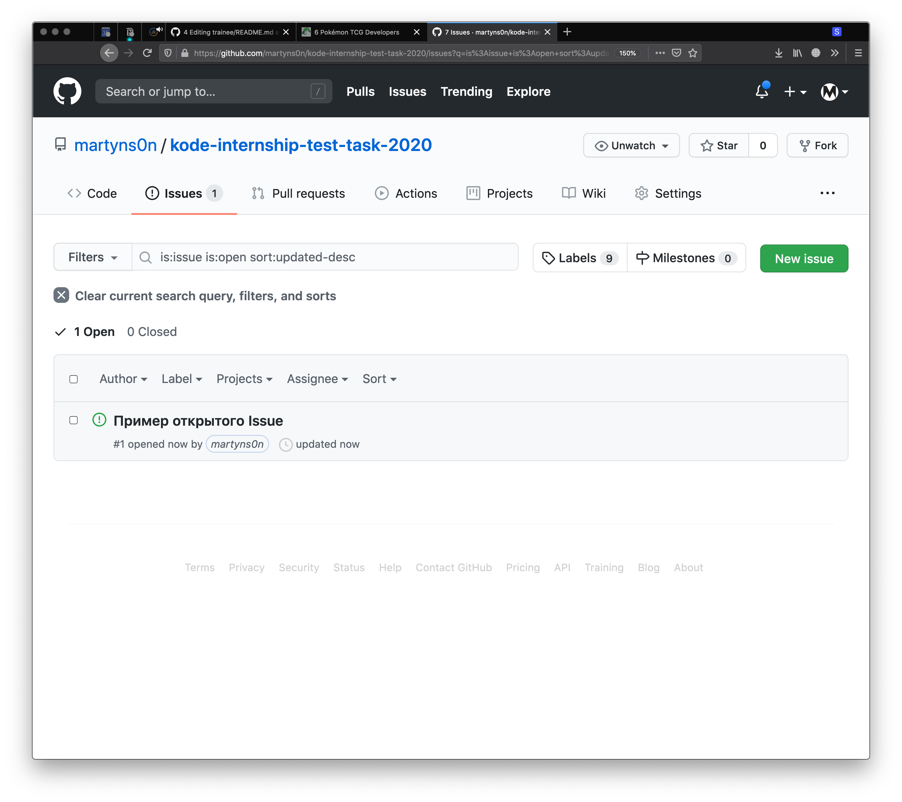

<p align="center">

  <a href="https://kode.ru/">
    
  </a>

  <h2 align="center">Стажировка
  Frontend</h2>

  <p>
    <p align="center">Ноябрь 2020</p>
  </p>
</p>

---
**СОДЕРЖАНИЕ**

- [Первое задание](#первое-задание)
  - [Примеры использования](#примеры-использования)
- [Второе задание](#второе-задание)
  - [Функциональность](#функциональность)
  - [Прототипы экранов (Wireframes)](#прототипы-экранов-wireframes)
  - [Задания со звёзочкой](#задания-со-звёзочкой)
  - [Стэк](#стэк)
- [Результаты](#результаты)
  - [Срок](#срок)
  - [Условия принятия](#условия-принятия)
- [Вопросы](#вопросы)

## Первое задание

Напишите функцию `getObjectProperty`.

Она получает три аргумента:
  - первым — объект
  - вторым — путь к вложенному свойству объекта
  - третьим (опциональный аргумент функции) — значение по умолчанию, которое возвращается, если значения по указанному пути не существует

Функция возвращает значение указанного свойства, либо `undefined`, если свойства не существует.

Стоит придумать своё решение без подключения библиотек и внешней помощи. Мы хотим убедиться в ваших навыках преобразования данных.

### Примеры использования

```js
const getObjectProperty = (obj, path, defaultValue) => {
  // TODO: your code here
}

const obj = {
  'pupa': {
    'lupa': {
      'beep': 'boop',
    },
    'foo': 'bar',
  },
};

getObjectProperty(obj, "pupa.lupa"); // > { beep : 'boop' }
getObjectProperty(obj, "pupa.lupa.beep"); // > 'boop'
getObjectProperty(obj, "pupa.foo"); // > 'bar'
getObjectProperty(obj, "pupa.ne.tuda"); // > undefined
getObjectProperty(obj, "pupa.ne.tuda", true); // > true
getObjectProperty(obj, "pupa.ne.tuda", "Default value"); // > 'Default value'
```

<details>
  <summary>Подсказки</summary>
  
  Пффф, смелее! Здесь вы справитесь и без нас 🙌

</details>

---

## Второе задание

Требуется реализовать приложение для просмотра распределенных по категориям карточек с Покемонами.

### Функциональность

Приложение содержит 4 экрана ([прототипы представлены ниже](#прототипы-экранов-wireframes)): 

#### 1. Экран авторизации

Страница представляет собой форму авторизации с валидацией соответствующих полей (логина и пароля).
   
Авторизация — НЕ серверная, введённые данные достаточно проверить на клиенте. 


#### 2. Экран подтверждения одноразового пароля

Подтверждение логина реализованное с помощью One Time Password (OTP).
   
Достаточно проверки на клиенте как и для первого экрана. Вы можете предложить свои варианты валидации и обработки ошибок.


#### 3. Экран категорий и просмотра карточек

Выбор категорий и просмотр соответствующего им списка карточек Покемонов.

Изменяя категории в селектах вы получаете данные с сервера.
   
**Используйте публичное API** – https://pokemontcg.io/.


   
#### 4. Просмотр карточки Покемона

Страница представляет собой отдельный экран с детальной информацией по Покемону.


### Прототипы экранов (Wireframes)

Дизайн интерфейса остаётся на ваше усмотрение. Представленные макеты прототипов имеют примерный вид и отражают функционал.

- [Макет в Figma](https://www.figma.com/file/dkQb8Bl61Mm91eBCLdd2nW/%D0%A2%D0%B5%D1%81%D1%82%D0%BE%D0%B2%D0%BE%D0%B5-%D0%B7%D0%B0%D0%B4%D0%B0%D0%BD%D0%B8%D0%B5-Pokemons-v2?node-id=0%3A1)
- [Снимки экранов](./images)

Также по ссылке на макет вы найдёте экраны для двух задач со звёздочкой: кастомного селекта и отображения карточек с пагинацией.

### Задания со звёзочкой

Если вы выполните следующие пункты (частично или полностью), то мы сможем точнее определить ваш уровень и степень вовлечённости. От этого зависит программа курса, собеседование и ваша оценка на протяжении стажировки.

Мы понимаем, что не все имеют достаточный опыт и/или возможности для выполения этих задач, поэтому оставляем их добровольными. Но тем ценнее их выполнение 😉

- [ ] Компонент «Селект категорий» написан самостоятельно. [Макет прототипа](https://www.figma.com/file/dkQb8Bl61Mm91eBCLdd2nW/%D0%A2%D0%B5%D1%81%D1%82%D0%BE%D0%B2%D0%BE%D0%B5-%D0%B7%D0%B0%D0%B4%D0%B0%D0%BD%D0%B8%D0%B5-Pokemons-v2?node-id=6%3A5)
- [ ] Пагинация карточек. [Макет прототипа](https://www.figma.com/file/dkQb8Bl61Mm91eBCLdd2nW/%D0%A2%D0%B5%D1%81%D1%82%D0%BE%D0%B2%D0%BE%D0%B5-%D0%B7%D0%B0%D0%B4%D0%B0%D0%BD%D0%B8%D0%B5-Pokemons-v2?node-id=1%3A103)
- [ ] Любые анимации интерфейса
- [ ] Быстрый просмотр покемона в модальном окне по клику на карточку
- [ ] Сохранение сессии авторизованного пользователя после закрытия вкладки браузера. Например, через local storage браузера
- [ ] Адаптивный дизайн

### Стэк

- [Create React App](https://create-react-app.dev/)
- [Function components + React Hooks](https://reactjs.org/docs/hooks-state.html#hooks-and-function-components)
- [React-router](https://reactrouter.com/web/api/Route/render-func)

## Результаты

### Срок

Две недели: **ДО 28 ОКТЯБРЯ ВКЛЮЧИТЕЛЬНО**

### Условия принятия

- Репозиторий на Github с решением задач
- Вторая задача доступна на Github Pages и открывается по url
  - [About Github Pages](https://www.figma.com/file/dkQb8Bl61Mm91eBCLdd2nW/%D0%A2%D0%B5%D1%81%D1%82%D0%BE%D0%B2%D0%BE%D0%B5-%D0%B7%D0%B0%D0%B4%D0%B0%D0%BD%D0%B8%D0%B5-Pokemons-v2?node-id=1%3A103)
  - [Одно из решений по автоматическому деплою на gh-pages](https://github.com/tschaub/gh-pages)
- Доступ в приложение по ключам:
  - Логин — `kode@kode.ru`
  - Пароль — `Enk0deng`
- В `README.md` репозитория указаны:
  - Декомпозиция: разбиение на подзадачи, их изначальная оценка и примерное время выполнения
  - Описание возникших сложностей в процессе
  - Что сделано из задач со звёздочкой
- Ссылки на решённые задачи отправлены нам ответным письмом

## Вопросы

Смело открывайте [Github Issue к этому репозиторию](https://github.com/martyns0n/kode-internship-test-task/issues) с любыми вопросами, замечаниями и предложениями. Мы ответим вам ~~в тот же день~~ в тот же день, честно.



### Уже заданные вопросы

- [Про реализацию OTP](https://github.com/martyns0n/kode-internship-test-task/issues/2)
- [Про использование библиотек во второй задаче](https://github.com/martyns0n/kode-internship-test-task/issues/4)
